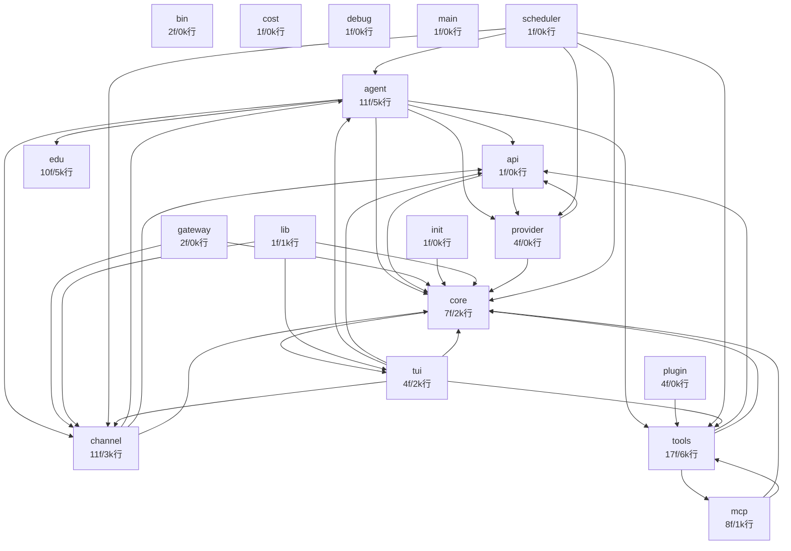

# RHermes Codegraph

> v0.7.0 · 87 .rs · ~34,500 行 · 自动生成（`python3 docs/codegraph_gen.py` 或询问 Agent 重新生成）

## 总览

| 指标 | 值 |
|------|-----|
| 源文件 | 87 |
| 总行数 | 34,566 |
| pub fn | 496 |
| 单元测试 | 267 |
| 核心 trait | Channel · EventSink · MemoryProvider · Plugin · SearchEngine · Tool · Transport |

## 模块依赖图

## 模块清单

| 模块 | 文件 | 行数 | pub fn | 测试 | traits | 依赖 |
|------|-----:|-----:|-------:|-----:|--------|------|
| `tools/` | 17 | 6,315 | 56 | 36 | Tool, SearchEngine | api, core, mcp |
| `agent/` | 11 | 5,717 | 100 | 58 | EventSink, MemoryProvider | api, channel, core, edu, provider, tools |
| `edu/` | 10 | 5,430 | 104 | 57 | — | — |
| `channel/` | 11 | 3,410 | 41 | 11 | Channel | agent, api, core |
| `core/` | 7 | 2,892 | 48 | 32 | — | tui |
| `tui/` | 4 | 2,611 | 13 | 19 | — | agent, api, channel, core, tools |
| `mcp/` | 8 | 1,832 | 51 | 11 | — | core, tools |
| `lib/` | 1 | 1,005 | 4 | 0 | — | channel, core, tui |
| `api/` | 1 | 986 | 11 | 6 | — | core, provider |
| `init/` | 1 | 877 | 1 | 0 | — | core |
| `gateway/` | 2 | 815 | 2 | 0 | — | channel, core |
| `provider/` | 4 | 811 | 12 | 0 | Transport | api, core |
| `plugin/` | 4 | 733 | 16 | 11 | Plugin | tools |
| `cost/` | 1 | 561 | 27 | 20 | — | — |
| `debug/` | 1 | 337 | 8 | 6 | — | — |
| `scheduler/` | 1 | 219 | 2 | 0 | — | agent, channel, core, provider, tools |
| `bin/` | 2 | 10 | 0 | 0 | — | — |
| `main/` | 1 | 5 | 0 | 0 | — | — |

## 核心 trait 索引

- **`Channel`** — `channel/mod.rs`
- **`EventSink`** — `agent/event_sink.rs`
- **`MemoryProvider`** — `agent/memory_manager.rs`
- **`Plugin`** — `plugin/mod.rs`
- **`SearchEngine`** — `tools/search/mod.rs`
- **`Tool`** — `tools/registry.rs`
- **`Transport`** — `provider/transport.rs`

## 关键类型（跨模块 pub struct/enum，按模块）

- **tools/**: `ReadFile`, `SearchContent`, `ReadPdf`, `Glob`, `WriteFile`, `RunCommand`, `GetCurrentTime`, `WebSearch`, `WebFetch`, `DelegateTask` (+35)
- **agent/**: `UmbrellaAction`, `SkillStatus`, `Curator`, `CuratorReport`, `TuiSink`, `ChannelSink`, `ValidationError`, `ValidationResult`, `ResponseValidator`, `NudgeBuilder` (+27)
- **edu/**: `AuthResult`, `LearnMode`, `CourseProfile`, `SwCommand`, `CourseContext`, `TeacherDashboard`, `ClassroomMessage`, `CourseBrief`, `LessonBrief`, `AssignmentBrief` (+21)
- **channel/**: `ChannelManager`, `ChannelStatus`, `ChannelState`, `QqApi`, `QqError`, `QqEvent`, `GroupMessage`, `GroupAuthor`, `C2cMessage`, `C2cAuthor` (+15)
- **core/**: `Config`, `ProxyMode`, `ProxyConfig`, `ChannelsConfig`, `WeComConfig`, `WeChatConfig`, `TelegramConfig`, `QqConfig`, `GatewayConfig`, `SchedulerConfig` (+21)
- **tui/**: `TuiChannel`, `AppCommand`, `Role`, `Message`, `Stats`, `App`
- **mcp/**: `McpLogLevel`, `McpToolInfo`, `McpResourceInfo`, `McpAdapter`, `McpAdapterManager`, `McpSseTransport`, `McpDirectTransport`, `McpTransportWrapper`, `McpRemoteTool`, `McpError` (+1)
- **lib/**: `Cli`, `CommonCommands`, `TeacherCli`, `TeacherCommands`, `StudentCli`, `StudentCommands`
- **api/**: `ChatRequest`, `ToolDef`, `ToolFunction`, `ChatResponse`, `Choice`, `ResponseMessage`, `ResponseToolCall`, `ResponseToolFunction`, `Usage`, `StreamEvent` (+7)
- **provider/**: `ProviderPool`, `DeepSeekTransport`
- **plugin/**: `ExtismPlugin`, `PluginRouter`, `SkillMdPlugin`, `PluginDescriptor`, `PluginSource`, `PluginOutput`, `PluginError`, `PluginEntry`, `RegistryToml`, `WasmSandboxConfig`
- **cost/**: `ModelTier`, `CostPreset`, `CostBreakdown`, `NeedsProDetector`, `ResultCompressor`, `CostController`
- **debug/**: `DebugEntry`, `SessionDebug`, `DebugStats`, `DebugError`
- **scheduler/**: `SchedulerShared`, `Scheduler`

## 大文件 Top 15

| 文件 | 行数 | pub fn | 测试 |
|------|-----:|-------:|-----:|
| `tools/builtin.rs` | 2,299 | 17 | 9 |
| `tui/mod.rs` | 2,164 | 9 | 9 |
| `core/config.rs` | 1,853 | 8 | 14 |
| `edu/store.rs` | 1,556 | 42 | 15 |
| `channel/wechat/mod.rs` | 1,016 | 3 | 6 |
| `lib.rs` | 1,005 | 4 | 0 |
| `api/mod.rs` | 986 | 11 | 6 |
| `agent/skill.rs` | 956 | 29 | 11 |
| `init.rs` | 877 | 1 | 0 |
| `agent/session.rs` | 869 | 8 | 0 |
| `agent/memory.rs` | 825 | 23 | 10 |
| `agent/repair.rs` | 807 | 10 | 19 |
| `edu/p2p.rs` | 759 | 18 | 8 |
| `edu/mod.rs` | 737 | 2 | 0 |
| `agent/router.rs` | 721 | 5 | 0 |
