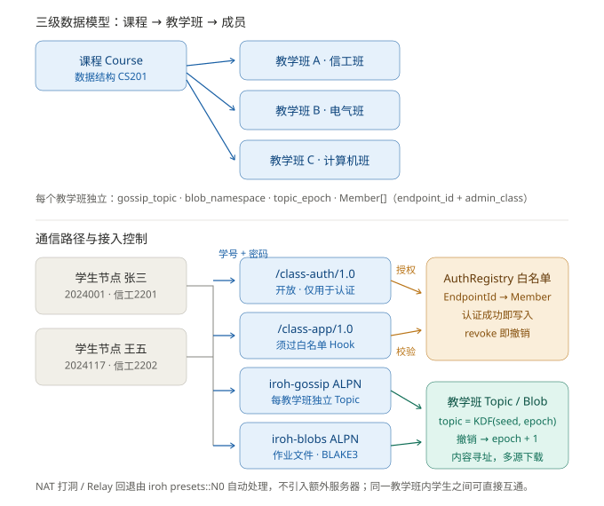

# RHermes 去中心化师生教学通信系统 — 设计方案与改造选项

> 目标：在现有 `src/edu/` 之上，用 **iroh 1.0.2 P2P 网络栈**实现「课程 → 教学班 → 成员」三级模型，
> 支持作业分发、答疑讨论、班内学生互通，并以**独立认证协议 + EndpointId 白名单**保证只有已认证学生才能通信。
>
> 状态：**设计待确认**（本文档只做设计与选项，不改动生产代码）
>
> 依赖基线：`iroh 1.0.2`（已在树） / `iroh-gossip 0.101`（依赖 iroh ^1） / `iroh-blobs 0.103`（依赖 iroh ^1）

---

## 0. 结论先行

现有 `src/edu/` **不是从零开始**——课程、教学班、课次、作业、提交、班级发布、Argon2 认证、iroh Endpoint 都已有可运行实现。真正缺的是四件事：

| 缺口 | 现状 | 需要补 |
|------|------|--------|
| **A. 三级授权模型** | `edu_classes` 是教学班，但成员表 `edu_enrollments` 挂在 **course** 上，且 `edu_students` 没有 `endpoint_id` 字段 | 成员表挂到 **section**，新增 `endpoint_id` / `admin_class` / 白名单状态 |
| **B. 白名单拦截** | 单一 ALPN `rhermes-edu/1`，任何知道 NodeID 的人都能连上并反复试密码 | 拆成 `/class-auth/1.0`（开放）+ `/class-app/1.0`（受控），用 `EndpointHooks::after_handshake` 强制白名单 |
| **C. 群组广播** | 只有「学生 → 老师」的请求/响应，没有「一班一 Topic」的多人广播 | `iroh-gossip`，每个教学班一个独立 `TopicId` |
| **D. 作业文件分发** | 作业只有标题/描述文本，无文件 | `iroh-blobs`（BLAKE3 内容寻址），gossip 只广播哈希通知 |

另有 **E. 教务系统对接**（可选）与 **F. 撤销授权的语义问题**（见 §5.4，这是本方案最关键的安全发现）。

---

## 1. 现状盘点：已有 vs 需求

### 1.1 已有的（可复用，不要重写）

| 位置 | 能力 |
|------|------|
| `src/edu/store.rs` | SQLite：`edu_teachers` / `edu_courses` / `edu_classes` / `edu_lessons_v2` / `edu_assignments` / `edu_class_publish` / `edu_submissions` / `edu_students` / `edu_enrollments` / `edu_sessions` / `edu_class_course_overrides` |
| `src/edu/auth.rs` | Argon2 密码校验 + 24h 会话 token（`authenticate` / `validate_token`） |
| `src/edu/p2p.rs` | iroh Endpoint 建连、`ClassroomMessage` 枚举、教师监听循环、学生请求/响应、HTTP 降级认证 |
| `src/edu/teacher.rs` | `TeacherManager`：建课、建班、建课次、加学生、批量导入、班级发布、板书覆盖 |
| `src/edu/mod.rs` | 完整的斜杠命令面（`/course` `/class` `/lesson` `/assignment` `/student` `/publish` `/submit` …） |
| `src/edu/dashboard.rs` | 教师 Web 仪表板（axum） |
| `src/edu/reflection.rs` | 学习反思与成长报告 |

### 1.2 与需求的精确差距

| 需求 | 现状 | 差距 |
|------|------|------|
| 课程 (Course) 有课程代码、名称 | ✅ `edu_courses(course_code, name)` | — |
| **一门课程可有多个老师教** | ⚠️ `edu_courses.teacher_id` 把课程**绑死在单个老师**上 | 需把 `teacher_id` 下移到 Section（或允许 Course 无主） |
| 教学班 (Section) = 授课单元 | ✅ `edu_classes(id, name, course_id)` | 缺 `teacher_id` / `term` / `gossip_topic` / `blob_namespace` |
| 教学班成员含 EndpointId + 用户名 + 行政班级 | ❌ `edu_enrollments(student_id, course_id)`；`edu_students` 无 `endpoint_id`、无 `admin_class` | 需新成员表 + `endpoint_id` / `admin_class` 列 |
| 学生可加入多个教学班 | ⚠️ 现挂在 course 上，一个学生多课可行，但**同课不同班**区分不了 | 成员表改挂 section 后自然解决 |
| 独立认证 ALPN，允许未认证连接 | ❌ 只有 `rhermes-edu/1` | 新增 `/class-auth/1.0` |
| 认证通过后把 EndpointId 加入白名单 | ❌ 无白名单概念 | 新增 `AuthRegistry`（内存 + DB 双写） |
| 应用 ALPN 经 Hook 检查白名单 | ❌ 无 `EndpointHooks` | 新增 `WhitelistHook` |
| 每教学班独立 Gossip Topic | ❌ 无 gossip | 新增 `iroh-gossip` |
| 每教学班独立 Blob 命名空间 | ❌ 作业无文件 | 新增 `iroh-blobs` |
| 撤销授权 | ❌ 无 | `registry.revoke` + **Topic 轮换**（见 §5.4） |
| 教务系统对接 | ❌ 只有手工 `/student import` | 新增 `registrar.rs`（只读同步） |

### 1.3 一个必须先解决的架构冲突

现有 `TeacherP2P::listen_loop()` 用的是 **手动 accept 循环**：

```rust
loop {
    match self.endpoint.accept().await { ... }
}
```

而 gossip / blobs 需要把它们的 ALPN 注册进 **`Router`**（`Router::builder(endpoint).accept(alpn, protocol)`）。
**`Router` 会接管 `endpoint.accept()`**，二者不能并存。

> 👉 结论：`TeacherP2P` 必须重构为「向 Router 注册一个 `ProtocolHandler`」。
> 这是本方案唯一的**破坏性重构点**，但它是引入 gossip/blobs 的硬前提。

---

## 2. 目标架构与目录树

### 2.1 模块划分

```
src/edu/
├── mod.rs                 斜杠命令面（扩展：/section /topic /announce）
├── model.rs            ★ 三级模型：Course / Section / Member（新增）
├── store.rs                SQLite（扩展：edu_sections / edu_members + 迁移）
│
├── auth.rs                 保留：Argon2 校验 + 会话 token
├── authz.rs            ★ AuthRegistry 白名单 + WhitelistHook（新增）
│
├── net/
│   ├── mod.rs          ★ ALPN 常量 + Router 装配（新增）
│   ├── auth_proto.rs   ★ /class-auth/1.0 ProtocolHandler（新增）
│   └── app_proto.rs    ★ /class-app/1.0 ProtocolHandler（新增）
│
├── gossip.rs           ★ 每 Section Topic 订阅/广播（新增）
├── blobs.rs            ★ 作业文件 add/download（新增）
├── registrar.rs        ★ 教务系统只读同步（新增，可选）
│
├── course.rs               保留：课程模板（tools/modes 白名单）
├── teacher.rs              保留：TeacherManager
├── dashboard.rs            保留：Web 仪表板
├── reflection.rs           保留：学习反思
├── setup.rs                保留：建课向导
├── e2e_tests.rs            保留：端到端测试
└── p2p.rs                  重构：旧单 ALPN 逻辑降级为 legacy / 被 net/ 取代
```

### 2.2 架构总览



四层职责：

| 层 | 组件 | 职责 |
|----|------|------|
| **传输** | `iroh::Endpoint` | QUIC/TLS、NAT 打洞、Relay 回退。**EndpointId = Ed25519 公钥**，是身份根 |
| **接入控制** | `EndpointHooks::after_handshake` | 按 ALPN 分流：`/class-auth/1.0` 放行；`/class-app/1.0` 查白名单 |
| **会话协议** | `auth_proto` / `app_proto` | 认证握手、教学班票据下发；作业提交、答疑单点请求 |
| **群组传播** | `iroh-gossip` + `iroh-blobs` | 每教学班一 Topic 广播；内容寻址的作业文件分发 |

---

## 3. 数据模型（三级结构）

### 3.1 结构体定义（`src/edu/model.rs`）

```rust
use serde::{Deserialize, Serialize};

/// ① 抽象课程：如「数据结构」（CS201）。与授课老师解耦——同一门课可由不同老师开不同教学班。
#[derive(Debug, Clone, Serialize, Deserialize)]
pub struct Course {
    pub id: i64,
    pub code: String,          // "CS201"
    pub name: String,          // "数据结构"
    pub description: String,
    /// 课程级默认工具白名单（Section 可覆盖）
    pub tools_whitelist: String,
    pub allowed_modes: String,
}

/// ② 教学班：真正的授课单元。如「数据结构-信工班」（张老师，信工2201+2202）
#[derive(Debug, Clone, Serialize, Deserialize)]
pub struct Section {
    pub id: i64,
    pub course_id: i64,
    pub teacher_id: i64,
    pub name: String,              // "数据结构-信工班"
    pub term: String,              // "2026-2027-1"
    /// 每教学班独立 Gossip Topic（32 字节）。**视为密钥**，仅经认证信道下发。
    pub gossip_topic: [u8; 32],
    /// 每教学班独立 Blob 命名空间种子（用于派生本地存储子目录 + 校验归属）
    pub blob_namespace: [u8; 32],
    /// Topic 纪元。撤销成员时 +1 → topic = KDF(seed, epoch)，旧 Topic 作废。
    pub topic_epoch: u32,
    pub created_at: String,
}

/// ③ 成员：老师与学生统一建模，挂在 Section 上
#[derive(Debug, Clone, Serialize, Deserialize)]
pub struct Member {
    pub id: i64,
    pub section_id: i64,
    pub user_id: i64,              // 指向 edu_teachers.id 或 edu_students.id
    pub role: MemberRole,
    pub username: String,          // 学号 / 工号
    pub display_name: String,
    /// 行政班级：如 "信工2201"（同一教学班可含多个行政班）
    pub admin_class: String,
    /// Iroh EndpointId（Ed25519 公钥 hex）。首次认证成功后写入，即「设备绑定」。
    pub endpoint_id: Option<String>,
    /// 白名单状态：授权 / 已撤销
    pub authorized: bool,
    pub joined_at: String,
    pub last_seen_at: Option<String>,
}

#[derive(Debug, Clone, Copy, PartialEq, Eq, Serialize, Deserialize)]
pub enum MemberRole { Teacher, Student }
```

### 3.2 关系示例

```
Course: 数据结构 (CS201)
├── Section A: 数据结构-信工班    teacher=张老师  term=2026-1
│      ├── Member 张老师   role=Teacher  admin_class=—
│      ├── Member 2024001 张三 role=Student  admin_class=信工2201  endpoint=ab12…
│      └── Member 2024117 王五 role=Student  admin_class=信工2202  endpoint=cd34…
├── Section B: 数据结构-电气班    teacher=张老师  term=2026-1
└── Section C: 数据结构-计算机班  teacher=李老师   term=2026-1
```

- 张老师**一个人**同时是 A、B 的任课老师 → 由 `Section.teacher_id` 表达（Course 不绑老师）。
- 张三同时在 A、C 两个教学班 → 由**两张 Member 行**表达（`section_id` 不同）。
- A 班同时含信工2201、2202 → 由 `Member.admin_class` 表达。

### 3.3 迁移方案（`PRAGMA user_version`）

沿用本项目 `/learn` 模块已验证的幂等迁移套路（`user_version` 逐级判断）：

```sql
-- v1: 新增两块表（不动旧表，零破坏）
CREATE TABLE IF NOT EXISTS edu_sections (
    id            INTEGER PRIMARY KEY AUTOINCREMENT,
    course_id     INTEGER NOT NULL REFERENCES edu_courses(id),
    teacher_id    INTEGER NOT NULL REFERENCES edu_teachers(id),
    name          TEXT NOT NULL,
    term          TEXT DEFAULT '',
    gossip_topic  BLOB NOT NULL,
    blob_namespace BLOB NOT NULL,
    topic_epoch   INTEGER NOT NULL DEFAULT 0,
    created_at    TEXT NOT NULL,
    UNIQUE(course_id, teacher_id, name, term)
);
CREATE INDEX IF NOT EXISTS idx_sections_course ON edu_sections(course_id);

CREATE TABLE IF NOT EXISTS edu_members (
    id           INTEGER PRIMARY KEY AUTOINCREMENT,
    section_id   INTEGER NOT NULL REFERENCES edu_sections(id) ON DELETE CASCADE,
    user_id      INTEGER NOT NULL,
    role         TEXT NOT NULL,            -- 'teacher' | 'student'
    username     TEXT NOT NULL,
    display_name TEXT DEFAULT '',
    admin_class  TEXT DEFAULT '',
    endpoint_id  TEXT,                     -- NULL = 尚未首次认证
    authorized   INTEGER NOT NULL DEFAULT 0,
    joined_at    TEXT NOT NULL,
    last_seen_at TEXT,
    UNIQUE(section_id, role, username)
);
CREATE INDEX IF NOT EXISTS idx_members_endpoint ON edu_members(endpoint_id);
CREATE INDEX IF NOT EXISTS idx_members_section  ON edu_members(section_id);
```

```sql
-- v2: 旧数据回填 —— 每个 edu_classes 行升级为一个 Section
INSERT INTO edu_sections (course_id, teacher_id, name, term, gossip_topic, blob_namespace, created_at)
SELECT c.id, c.teacher_id, cl.name, '',
       randomblob(32), randomblob(32), cl.created_at
FROM edu_classes cl JOIN edu_courses c ON c.id = cl.course_id;
```

**回填的诚实说明**：`randomblob(32)` 生成的是**新 Topic**，与旧数据无关联；由于旧系统本来就没有 gossip，这没有语义损失。旧表**全部保留**，`/class` 等既有命令继续工作，实现零停机迁移。

> ⚠️ 与 `/learn` 模块同源的踩坑：`row_to_node` 那种**按列序号读取**的写法，在给旧表加列后必须同步更新全部 SELECT。本次策略是**不改旧表、只加新表**，从根上规避该风险。

---

## 4. 认证与授权：双 ALPN + EndpointHooks 白名单

### 4.1 ALPN 规划（`src/edu/net/mod.rs`）

```rust
/// 认证协议：允许未认证连接接入（白名单唯一入口）
pub const ALPN_AUTH: &[u8] = b"/class-auth/1.0";
/// 应用协议：仅白名单节点可接入（作业提交、单点答疑、票据换取）
pub const ALPN_APP: &[u8] = b"/class-app/1.0";
```

`iroh-gossip` / `iroh-blobs` 的 ALPN 由各自 crate 提供常量（`iroh_gossip::ALPN` / `iroh_blobs::ALPN`）。

### 4.2 白名单注册表 + Hook（`src/edu/authz.rs`）

> 事实校对：iroh 1.0.2 的 `EndpointHooks` **不是 dyn 兼容 trait**，因此 Hook 类型必须具体化；且官方明确要求 **Hook 内部不得持有 `Endpoint`**（会形成引用计数环导致内存泄漏）。所以白名单必须通过共享状态（`Arc<RwLock<…>>`）注入。

```rust
use std::collections::HashMap;
use std::sync::Arc;
use tokio::sync::RwLock;
use iroh::endpoint::{AfterHandshakeOutcome, Connection, EndpointHooks};
use iroh::EndpointId;
use noq::VarInt;

use super::net::{ALPN_AUTH, ALPN_APP};

#[derive(Debug, Clone)]
pub struct MemberBinding {
    pub username: String,
    pub display_name: String,
    pub admin_class: String,
    /// 该节点被授权可参与的教学班
    pub sections: Vec<i64>,
}

/// 全局授权表：EndpointId -> 成员绑定
#[derive(Debug, Clone, Default)]
pub struct AuthRegistry {
    inner: Arc<RwLock<HashMap<EndpointId, MemberBinding>>>,
}

impl AuthRegistry {
    pub fn new() -> Self { Self::default() }

    pub async fn grant(&self, id: EndpointId, b: MemberBinding) {
        self.inner.write().await.insert(id, b);
    }

    /// 撤销授权。返回 true 表示确实移除了。
    /// ⚠️ 仅移除白名单**不足以**阻止其继续接收 gossip —— 见 §5.4。
    pub async fn revoke(&self, id: &EndpointId) -> bool {
        self.inner.write().await.remove(id).is_some()
    }

    pub async fn is_authorized(&self, id: &EndpointId) -> bool {
        self.inner.read().await.contains_key(id)
    }

    pub async fn binding(&self, id: &EndpointId) -> Option<MemberBinding> {
        self.inner.read().await.get(id).cloned()
    }
}

/// Endpoint Hook：按 ALPN 强制白名单
#[derive(Debug, Clone)]
pub struct WhitelistHook {
    registry: AuthRegistry,
}

impl WhitelistHook {
    pub fn new(registry: AuthRegistry) -> Self { Self { registry } }
}

impl EndpointHooks for WhitelistHook {
    async fn after_handshake(&self, conn: &Connection) -> AfterHandshakeOutcome {
        // 类型兼容写法：alpn() 返回类型随版本可能是 Vec<u8> 或 &[u8]，统一成切片比较
        let alpn: &[u8] = &conn.alpn();

        // 认证协议必须放行，否则无人能完成首次认证
        if alpn == ALPN_AUTH {
            return AfterHandshakeOutcome::Accept;
        }

        // 应用协议：只放行白名单内的 EndpointId
        if alpn == ALPN_APP {
            let remote = conn.remote_id();
            if self.registry.is_authorized(&remote).await {
                return AfterHandshakeOutcome::Accept;
            }
            tracing::warn!("拒绝未授权节点 {remote} 接入 /class-app/1.0");
            return AfterHandshakeOutcome::Reject {
                error_code: VarInt::from_u32(403),
                reason: b"unauthorized".to_vec(),
            };
        }

        // gossip / blobs 等其余 ALPN 交由 Router 的分发器处理
        AfterHandshakeOutcome::Accept
    }
}
```

装配：

```rust
use iroh::endpoint::presets;

let registry = AuthRegistry::new();
let endpoint = iroh::Endpoint::builder(presets::N0)
    .alpns(vec![
        ALPN_AUTH.to_vec(),
        ALPN_APP.to_vec(),
        iroh_gossip::ALPN.to_vec(),
        iroh_blobs::ALPN.to_vec(),
    ])
    .hooks(WhitelistHook::new(registry.clone()))   // ★ 接入控制
    .bind()
    .await?;
```

### 4.3 Router 装配（取代旧的 `endpoint.accept()` 循环）

```rust
use iroh::protocol::Router;
use iroh_gossip::Gossip;
use iroh_blobs::{store::mem::MemStore, BlobsProtocol};

let store = MemStore::new();                       // 生产可换 FsStore 持久化
let gossip = Gossip::builder().spawn(endpoint.clone());

let router = Router::builder(endpoint.clone())
    .accept(iroh_gossip::ALPN, gossip.clone())
    .accept(iroh_blobs::ALPN, BlobsProtocol::new(&store, None))
    .accept(ALPN_AUTH, AuthHandler::new(db_path.clone(), registry.clone()))
    .accept(ALPN_APP, AppHandler::new(db_path.clone(), registry.clone()))
    .spawn();
```

### 4.4 老师端认证处理器（`net/auth_proto.rs`）

```rust
use iroh::protocol::{AcceptError, ProtocolHandler};

/// 认证协议的线格式（JSON 便于调试，后续可切 postcard 省字节）
#[derive(serde::Deserialize)]
struct AuthRequest {
    username: String,
    password: String,
    /// 客户端身份声明（服务端以 TLS 握手中的 remote_id 为准，此字段仅作日志）
    claimed_endpoint: Option<String>,
}

#[derive(serde::Serialize)]
struct TopicTicket {
    section_id: i64,
    section_name: String,
    course_code: String,
    /// 32 字节 Topic，hex 编码
    topic_id: String,
    topic_epoch: u32,
    /// 引导节点：老师自身 EndpointId
    bootstrap: Vec<String>,
    /// 作业文件的分发入口（老师 EndpointId，学生据此拉 blob）
    provider: String,
}

#[derive(serde::Serialize)]
struct AuthResponse {
    ok: bool,
    message: String,
    /// 会话 token（用于 app 协议内的细粒度操作鉴权）
    token: Option<String>,
    /// 该学生被授权的全部教学班票据（**只经此加密信道下发**）
    tickets: Vec<TopicTicket>,
}

pub struct AuthHandler {
    db_path: std::path::PathBuf,
    registry: AuthRegistry,
}

impl AuthHandler {
    pub fn new(db_path: std::path::PathBuf, registry: AuthRegistry) -> Self {
        Self { db_path, registry }
    }
}

impl ProtocolHandler for AuthHandler {
    async fn accept(&self, conn: iroh::endpoint::Connection) -> Result<(), AcceptError> {
        // 关键：身份以 TLS 握手的 remote_id 为准，客户端无法伪造
        let remote: iroh::EndpointId = conn.remote_id();

        let (mut send, mut recv) = conn.accept_bi().await?;
        let req_bytes = recv.read_to_end(16 * 1024).await?;
        let req: AuthRequest = serde_json::from_slice(&req_bytes)
            .map_err(|e| AcceptError::from_err(anyhow::anyhow!("bad auth request: {e}")))?;

        let store = EduStore::open(&self.db_path)?;

        // 复用现有 Argon2 校验（auth.rs 的 authenticate）
        let resp = match crate::edu::auth::authenticate(&store, &req.username, &req.password) {
            Ok(r) => {
                // 1) 查询该学生被授权的教学班
                let sections = store.sections_for_student(&req.username).unwrap_or_default();

                // 2) 绑定 EndpointId → 白名单（内存 + 落库）
                let binding = MemberBinding {
                    username: req.username.clone(),
                    display_name: r.student_name.clone(),
                    admin_class: store.admin_class_of(&req.username).unwrap_or_default(),
                    sections: sections.iter().map(|s| s.id).collect(),
                };
                self.registry.grant(remote, binding).await;
                store.bind_endpoint(&req.username, &remote.to_string()).ok();

                // 3) 组装教学班票据
                let tickets = sections.into_iter().map(|s| TopicTicket {
                    section_id: s.id,
                    section_name: s.name.clone(),
                    course_code: s.course_code.clone(),
                    topic_id: hex::encode(s.gossip_topic),
                    topic_epoch: s.topic_epoch,
                    bootstrap: vec![conn.endpoint_id().to_string()],
                    provider: conn.endpoint_id().to_string(),
                }).collect();

                AuthResponse {
                    ok: true,
                    message: "认证成功".into(),
                    token: Some(r.token),
                    tickets,
                }
            }
            Err(e) => AuthResponse {
                ok: false,
                message: format!("学号或密码错误: {e}"),
                token: None,
                tickets: vec![],
            },
        };

        send.write_all(&serde_json::to_vec(&resp)?).await?;
        send.finish()?;
        // 给对端时间读完再关闭
        conn.closed().await;
        Ok(())
    }
}
```

### 4.5 学生端认证流程

```rust
use iroh::{Endpoint, EndpointAddr, EndpointId};

pub struct StudentClient {
    endpoint: Endpoint,
    teacher: EndpointAddr,
}

impl StudentClient {
    /// 建立教师地址（NodeID 直接构造，或从 EndpointAddr 解析）
    pub fn set_teacher(&mut self, node_id: &str) -> Result<(), String> {
        let key: EndpointId = node_id.parse().map_err(|e| format!("无效 NodeID: {e}"))?;
        self.teacher = EndpointAddr::new(key);
        Ok(())
    }

    /// 首次认证：走 /class-auth/1.0（此时尚未进入白名单）
    pub async fn login(&self, username: &str, password: &str) -> Result<LoginOk, String> {
        let conn = self.endpoint
            .connect(self.teacher.clone(), super::net::ALPN_AUTH)
            .await
            .map_err(|e| format!("连接教师失败: {e}"))?;

        let (mut send, mut recv) = conn.open_bi().await.map_err(|e| e.to_string())?;
        let req = serde_json::json!({
            "username": username,
            "password": password,
            "claimed_endpoint": self.endpoint.id().to_string(),
        });
        send.write_all(&serde_json::to_vec(&req).unwrap()).await.map_err(|e| e.to_string())?;
        send.finish().map_err(|e| e.to_string())?;

        let raw = recv.read_to_end(64 * 1024).await.map_err(|e| e.to_string())?;
        let resp: AuthResponse = serde_json::from_slice(&raw).map_err(|e| e.to_string())?;
        if !resp.ok { return Err(resp.message); }

        // 认证完成后，本节点已在老师白名单内；后续 /class-app/1.0 与 gossip 均可直连
        Ok(LoginOk {
            token: resp.token.unwrap_or_default(),
            tickets: resp.tickets,
        })
    }
}
```

### 4.6 安全权衡（两个可选加固层次）

| 方案 | 做法 | 优点 | 代价 |
|------|------|------|------|
| **A（推荐）** | 密码走 QUIC/TLS 加密信道 + Argon2 校验 + 认证成功即绑定 `remote_id` | 实现简单、语义清晰；密码**不会明文出现在网络上** | 密码仍是「一次性凭据」，理论上可重放（但重放方拿不到对方私钥，无法冒充其 EndpointId） |
| **B（加固）** | challenge-response：老师先发 nonce，学生用 Ed25519 私钥签名；密码仅用于首次注册 | 防重放；把「密码」与「设备私钥」双重绑定 | 需管理客户端密钥持久化与找回流程 |

> 注：无论 A/B，**EndpointId 即身份** —— 因为 iroh 的 TLS 握手用的是节点自身密钥，`conn.remote_id()` 不可伪造。
> 这让「白名单」天然具备密码学强度，而不是 IP 白名单那种可绕过的弱控制。

---

## 5. 通信机制

### 5.1 教学班 Topic 的派生（含轮换）

`gossip_topic` 不直接长期使用，而是以「种子 + 纪元」派生，便于撤销时一键换 Topic：

```rust
use blake3::Hasher;

/// topic = BLAKE3("rhermes-section-topic" || seed || epoch)
pub fn derive_topic(seed: &[u8; 32], epoch: u32) -> [u8; 32] {
    let mut h = Hasher::new();
    h.update(b"rhermes-section-topic");
    h.update(seed);
    h.update(&epoch.to_le_bytes());
    *h.finalize().as_bytes()
}
```

> 为什么需要 `epoch`：见 §5.4。

### 5.2 每教学班独立 Topic：订阅与广播（`src/edu/gossip.rs`）

```rust
use futures_util::StreamExt;
use iroh::{Endpoint, EndpointId};
use iroh_gossip::{api::Event, Gossip, TopicId};

#[derive(serde::Serialize, serde::Deserialize)]
#[serde(tag = "kind")]
pub enum SectionMsg {
    /// 作业发布通知（只带哈希，不带文件！）
    AssignmentPosted {
        assignment_id: i64,
        title: String,
        blob_hash: String,        // BLAKE3 hex
        blob_ticket: String,      // BlobTicket 字符串（含 provider 地址）
        due_date: String,
        posted_by: String,
        ts: String,
    },
    /// 答疑：学生提问
    Question {
        from: String,             // 学号
        admin_class: String,
        text: String,
        ts: String,
    },
    /// 答疑：老师或同学回答
    Answer {
        from: String,
        reply_to: String,         // 关联的问题 id/nonce
        text: String,
        ts: String,
    },
    /// 班内自由讨论
    Chat { from: String, text: String, ts: String },
    /// 教师广播通知 / 模式切换
    Announce { title: String, body: String, ts: String },
    /// 撤销成员后的 Topic 轮换通知（见 §5.4）
    TopicRotate { new_epoch: u32, new_topic_id: String, ts: String },
}

/// 教学班会话：持有 GossipSender 以便随时广播
pub struct SectionSession {
    topic: TopicId,
    sender: iroh_gossip::api::GossipSender,
}

impl SectionSession {
    /// 学生加入：bootstrap 只需老师一个节点（老师已在线，gossip 会自行扩散建立 mesh）
    pub async fn join(
        gossip: &Gossip,
        seed: &[u8; 32],
        epoch: u32,
        bootstrap: Vec<EndpointId>,
    ) -> anyhow::Result<(Self, impl StreamExt<Item = anyhow::Result<Event>>)> {
        let topic = TopicId::from_bytes(derive_topic(seed, epoch));
        let (sender, receiver) = gossip.subscribe(topic, bootstrap).await?.split();
        Ok((Self { topic, sender }, receiver))
    }

    /// 广播（作业通知 / 提问 / 讨论 / 公告 都走这里）
    pub async fn broadcast(&self, msg: &SectionMsg) -> anyhow::Result<()> {
        let bytes = postcard::to_allocvec(msg)?;
        self.sender.broadcast(bytes.into()).await?;
        Ok(())
    }

    /// 接收循环：同一教学班内，师生消息完全对等（学生之间也能互收）
    pub async fn run_receiver(
        mut rx: impl StreamExt<Item = anyhow::Result<Event>> + Unpin,
        on_msg: impl Fn(SectionMsg, EndpointId),
    ) -> anyhow::Result<()> {
        while let Some(ev) = rx.next().await {
            match ev? {
                Event::Received(m) => {
                    if let Ok(msg) = postcard::from_bytes::<SectionMsg>(&m.content) {
                        on_msg(msg, m.delivered_from);
                    }
                }
                Event::NeighborUp(id) => tracing::info!("[topic] 邻居加入: {id}"),
                Event::NeighborDown(id) => tracing::info!("[topic] 邻居离开: {id}"),
                _ => {}
            }
        }
        Ok(())
    }
}
```

老师端对**每个自己任教的教学班**各持一个 `SectionSession`，并在其上广播作业与公告：

```rust
// 老师启动时为每个 section 订阅
for sec in store.sections_by_teacher(teacher_id)? {
    let (session, rx) = SectionSession::join(
        &gossip,
        &sec.blob_namespace_seed,   // Topic 种子
        sec.topic_epoch,
        vec![],                     // 老师自己是 topic 的起点，无需 bootstrap
    ).await?;
    sessions.insert(sec.id, session);
    tokio::spawn(SectionSession::run_receiver(rx, move |m, from| {
        tracing::info!("[section {}] {m:?} from {from}", sec.id);
    }));
}
```

### 5.3 Topic 隔离

| 隔离维度 | 手段 |
|----------|------|
| 教学班之间 | **不同 TopicId**（32 字节随机种子 + 纪元派生）→ 消息物理隔离 |
| 未认证者 | Topic 票据**只经 `/class-auth/1.0` 加密信道下发**；TopicId 本身即能力凭据 |
| Blob 存储 | 每班独立 `blob_namespace`，本地按班级分目录；跨班不可见 |
| 应用级操作 | `/class-app/1.0` 内所有请求校验「token → 学号 → 是否属于该 section」 |

### 5.4 ⚠️ 撤销授权的真正难点（本方案最关键的安全发现）

「把 EndpointId 从白名单移除」只解决了 **`/class-app/1.0` 直连**。但 gossip 是**网状传播**的：

- 被撤销的学生**已经知道 TopicId**，且学生的 Endpoint 通常**没有装 `WhitelistHook`**（学生是客户端）；
- 因此他仍可连到**其他学生**，继续收发该 Topic 的消息 —— 白名单此时形同虚设。

三种应对（**这是需要你拍板的核心选项之一**）：

| 方案 | 机制 | 强度 | 复杂度 |
|------|------|------|--------|
| **R1 Topic 轮换** | 撤销时 `topic_epoch += 1`，老师把 `TopicRotate{new_epoch,new_topic}` 广播给**剩余成员**，并在新 Topic 继续；旧 Topic 自然废弃 | 中（撤销后即时失效，前提是剩余成员在线收到轮换；离线者下次登录时会从 `/class-auth` 票据拿到新纪元） | 低 |
| **R2 分布式白名单** | 每位学生的 Endpoint 也安装 `WhitelistHook`，老师通过 gossip 广播**签名成员表**（Ed25519 签名 + 纪元号），学生本地校验 | 高（连学生间连接也被拦） | 中 |
| **R3 R1 + R2 组合** | 轮换治本 + 分布式白名单治标，双保险 | 最高 | 中高 |

> 推荐 **R1 起步**（满足「撤销授权」的功能需求），若课程对防作弊/防泄露有硬要求，再升级到 **R3**。
> 需要注意：R2 的签名成员表必须带**老师签名**，否则恶意学生可自造白名单。

### 5.5 NAT 穿透

完全交给 iroh：`presets::N0` 已含 n0 的公有 Relay + DNS 发现（`iroh-dns`，见 Cargo.lock）。
老师端在打洞失败时走该 Relay 回退，无需自建服务器；若学校内网封锁 UDP，可用 `Endpoint::builder(...).relay_mode(...)` 指定自建 Relay。**本方案不引入额外网络设施**。

---

## 6. 作业发布与下载（iroh-blobs）

### 6.1 老师发布（`src/edu/blobs.rs`）

```rust
use iroh::{Endpoint, EndpointAddr};
use iroh_blobs::{
    store::mem::MemStore,
    ticket::BlobTicket,
    Hash,
};

/// 发布作业文件：加入本地 blob 存储 → 得到 BLAKE3 哈希 → 生成票据 → gossip 广播通知
pub async fn publish_assignment_file(
    store: &MemStore,
    endpoint: &Endpoint,
    session: &super::gossip::SectionSession,
    assignment_id: i64,
    title: &str,
    file_bytes: &[u8],
    due_date: &str,
    teacher_name: &str,
) -> anyhow::Result<Hash> {
    // 1) 内容寻址：add_slice 返回 tag（含 BLAKE3 哈希）
    let tag = store.add_slice(file_bytes).await?;

    // 2) 票据 = provider 地址 + 哈希 + 格式，学生凭票即可定位并校验下载
    let ticket = BlobTicket::new(endpoint.addr(), tag.hash, tag.format);

    // 3) 只广播「通知 + 哈希 + 票据」，文件本体不进 gossip
    session
        .broadcast(&super::gossip::SectionMsg::AssignmentPosted {
            assignment_id,
            title: title.into(),
            blob_hash: tag.hash.to_string(),
            blob_ticket: ticket.to_string(),
            due_date: due_date.into(),
            posted_by: teacher_name.into(),
            ts: chrono::Utc::now().to_rfc3339(),
        })
        .await?;

    Ok(tag.hash)
}
```

> 老师既是 gossip 成员也是 blob **provider**（`BlobsProtocol` 已在 Router 上注册），
> 因此学生连上老师即可拉文件，无需任何中心服务器。

### 6.2 学生下载

```rust
use iroh_blobs::ticket::BlobTicket;
use iroh_blobs::api::blobs::Blobs;   // 高层 API（0.103 线）

/// 收到 AssignmentPosted 通知后调用
pub async fn fetch_assignment_file(
    endpoint: &Endpoint,
    store: &MemStore,
    ticket_str: &str,
    expected_hash_hex: &str,
) -> anyhow::Result<Vec<u8>> {
    let ticket: BlobTicket = ticket_str.parse()?;

    // 完整性预检：票据里的哈希必须与通知中的哈希一致（防篡改）
    let want: iroh_blobs::Hash = expected_hash_hex.parse()?;
    anyhow::ensure!(ticket.hash == want, "票据哈希与通知不一致，可能被篡改");

    // 触发多源下载；下载完成后 blob 已在本地 store，且 BLAKE3 流式校验
    let blobs = Blobs::new(store, endpoint.clone(), None);
    blobs.download(ticket.hash, Some(vec![ticket.addr.id]).into()).await?;

    // 读取为字节
    let bytes = store.get_bytes(ticket.hash).await?;
    Ok(bytes.to_vec())
}
```

> ⚠️ **API 需按 0.103 实测微调**：上面 `Blobs::new` / `download` / `get_bytes` 是 iroh-blobs 0.103 的高层入口形态，
> 各 0.9x/0.10x 小版本间方法名有变动。落地前请用 `cargo doc -p iroh-blobs --open` 核对一次（见 §8.2 验证清单）。

### 6.3 为什么「哈希走 gossip、文件走 blobs」是最优解

| 做法 | 问题 |
|------|------|
| 文件 base64 内联进 gossip | gossip 消息有大小限制；大文件会拖垮整个 mesh 的转发效率 |
| 中心 HTTP 下载 | 退化为 C/S，老师离线即不可用 |
| **哈希通知 + blobs 拉取** | gossip 只传 32 字节 + 票据；文件**多源并行下载 + BLAKE3 增量校验**；任一持有者（老师或已下载的同学）都可作 provider |

---

## 7. 与教务系统对接（可选，`src/edu/registrar.rs`）

定位：**教务系统只提供权威名单，认证仍由 Iroh P2P 层完成**。同步是**只读**的。

### 7.1 抽象接口

```rust
use async_trait::async_trait;

#[derive(Debug, Clone, serde::Serialize, serde::Deserialize)]
pub struct SectionSpec {
    pub section_no: String,      // 教务侧唯一教学班号
    pub course_code: String,
    pub course_name: String,
    pub teacher_no: String,      // 工号
    pub teacher_name: String,
    pub term: String,
    pub section_name: String,    // "数据结构-信工班"
}

#[derive(Debug, Clone, serde::Serialize, serde::Deserialize)]
pub struct StudentSpec {
    pub student_no: String,
    pub name: String,
    pub admin_class: String,     // "信工2201"
}

#[async_trait]
pub trait RegistrarClient: Send + Sync {
    /// 老师本学期开设的教学班
    async fn teacher_sections(&self, teacher_no: &str, term: &str)
        -> anyhow::Result<Vec<SectionSpec>>;
    /// 教学班选课名单（含行政班级）
    async fn section_roster(&self, section_no: &str)
        -> anyhow::Result<Vec<StudentSpec>>;
    /// 学生本学期已选的教学班
    async fn student_sections(&self, student_no: &str, term: &str)
        -> anyhow::Result<Vec<SectionSpec>>;
}
```

### 7.2 两种实现

```rust
/// ① REST 实现：教务系统暴露只读 JSON 接口
pub struct HttpRegistrar { base_url: String, token: String, client: reqwest::Client }

#[async_trait]
impl RegistrarClient for HttpRegistrar {
    async fn teacher_sections(&self, teacher_no: &str, term: &str) -> anyhow::Result<Vec<SectionSpec>> {
        let url = format!("{}/api/registrar/teachers/{teacher_no}/sections?term={term}", self.base_url);
        let r = self.client.get(&url).bearer_auth(&self.token).send().await?.error_for_status()?;
        Ok(r.json::<Vec<SectionSpec>>().await?)
    }
    // ... section_roster / student_sections 同构
}

/// ② CSV 实现：离线场景，教务导出 Excel/CSV 后本地导入
pub struct CsvRegistrar { sections_csv: std::path::PathBuf, roster_dir: std::path::PathBuf }
```

### 7.3 对接的 REST 契约（建议教务侧提供）

| 方法 | 路径 | 返回 |
|------|------|------|
| GET | `/api/registrar/teachers/{teacher_no}/sections?term=` | `[SectionSpec]` |
| GET | `/api/registrar/sections/{section_no}/roster` | `[StudentSpec]` |
| GET | `/api/registrar/students/{student_no}/sections?term=` | `[SectionSpec]` |

### 7.4 同步命令

```bash
# 老师：拉取自己本学期教学班 + 各班名单 → 落 edu_sections / edu_members
rhermes edu teacher sync --term 2026-2027-1

# 学生：拉取自己已选教学班 → 显示待加入列表
rhermes edu student sync --term 2026-2027-1
```

同步语义：**upsert**。以 `(course_code, teacher_no, section_name, term)` 为业务主键；
**已存在的 `gossip_topic` / `topic_epoch` 与 `endpoint_id` 绑定一律不覆盖**，避免同步把授权状态冲掉。

---

## 8. 依赖与落地验证

### 8.1 Cargo.toml 增量

```toml
[dependencies]
iroh = "1.0"                     # 已有（当前解析 1.0.2）
iroh-gossip = "0.101"            # 新增：依赖 iroh ^1（已核实）
iroh-blobs = "0.103"             # 新增：依赖 iroh ^1（已核实）
blake3 = "1"                     # 新增：Topic 派生 / 哈希字符串
hex = "0.4"                      # 新增：Topic/EndpointId 的 hex 展示
postcard = { version = "1", features = ["alloc"] }   # 新增：gossip 消息紧凑序列化
rand = "0.8"                     # 已有：种子生成
argon2 = "0.5"                   # 已有：密码哈希
futures-util = "0.3"             # 已有：StreamExt
anyhow = "1"                     # 如需（本项目现用 String 错误，可保持一致不加）
```

### 8.2 ✅ API 核验结果（已逐条对照源码 / docs.rs 确认，2026-09-11）

解析版本：**iroh 1.0.2 · iroh-gossip 0.101.0 · iroh-blobs 0.103.0 · iroh-base 1.0.2**

#### iroh 1.0.2

| 用途 | 真实签名 |
|------|----------|
| 建端点 | `Endpoint::builder(preset: impl Preset) -> Builder`；`.alpns(Vec<Vec<u8>>)`、`.hooks(impl EndpointHooks + 'static)`、`.bind().await -> Result<Endpoint, BindError>` |
| 本机标识 | `Endpoint::id() -> EndpointId`；`Endpoint::addr() -> EndpointAddr`；`Endpoint::online().await` |
| Hook trait | `EndpointHooks: Debug + Send + Sync`（**非 dyn 兼容**，须具体类型）；`after_handshake(&self, &Connection) -> impl Future<Output = AfterHandshakeOutcome>` |
| 拒绝 | `AfterHandshakeOutcome::Reject { error_code: VarInt, reason: Vec<u8> }` |
| 连接读取 | `Connection<State = HandshakeCompleted>`；`alpn() -> &[u8]`（**不是 Vec**）、`remote_id() -> EndpointId`、`accept_bi()`、`closed()`；**无** `endpoint_id()`（本地 id 需构造时注入） |
| 路由 | `Router::builder(Endpoint).accept(impl AsRef<[u8]>, impl Into<Box<dyn DynProtocolHandler>>).spawn()`；`spawn()` 会把已注册 ALPN 写回 Endpoint |
| Handler | `ProtocolHandler: Send + Sync + Debug + 'static`（**必须 derive Debug**）；`async fn accept(&self, Connection) -> Result<(), AcceptError>` |

#### iroh-gossip 0.101.0

| 用途 | 真实签名 |
|------|----------|
| 重导出 | 根有 `pub use net::Gossip;`、`pub use proto::TopicId;`，常量 `iroh_gossip::ALPN` |
| 订阅 | `Gossip::builder().spawn(endpoint.clone())`；`gossip.subscribe(TopicId, Vec<EndpointId>).await? -> GossipTopic`，再 `.split() -> (GossipSender, GossipReceiver)` |
| 广播 | `GossipSender::broadcast(Bytes)`（`&self`）；`GossipTopic::broadcast(&mut self, Bytes)` |
| 事件 | `enum Event { NeighborUp(EndpointId), NeighborDown(EndpointId), Received(Message), Lagged }`（⚠️ `Lagged` **无载荷**） |
| 消息 | `struct Message { content: Bytes, scope: DeliveryScope, delivered_from: EndpointId }` |

#### iroh-blobs 0.103.0

| 用途 | 真实签名 |
|------|----------|
| 重导出 | 根有 `pub use protocol::ALPN;`、`struct Hash`、`struct BlobsProtocol` |
| 加入 | `Blobs::add_slice(&self, impl AsRef<[u8]>) -> AddProgress<'_>`，`await` 得 `Tag { name, hash, format }` |
| 读回 | `Blobs::get_bytes(&self, impl Into<Hash>) -> ExportBaoResult<Bytes>` |
| 下载 | `Downloader::new(&Store, &Endpoint)`；`.download(Hash, impl ContentDiscovery) -> DownloadProgress`；`.complete().await`。**没有** `download_with_opts(hash, opts, providers)` |
| 多源 | `Vec<EndpointId>` 经 blanket impl 自动满足 `ContentDiscovery` |
| 票据 | `BlobTicket::new(EndpointAddr, Hash, BlobFormat)`；字段**私有** → 取值用 `hash()` / `addr()` / `format()` / `into_parts()` |
| store 视图 | `MemStore: Deref<Target = api::Store>`，`api::Store: Deref<Target = api::blobs::Blobs>` → `store.add_slice(..)` 直接可用 |
| 协议处理 | `BlobsProtocol::new(&Store, Option<EventSender>)` |
| 地址 | `EndpointAddr { pub id: EndpointId, pub addrs: BTreeSet<TransportAddr> }` |

```bash
# 编译冒烟
RH_SKIP_WINRESOURCE=1 cargo check --all-targets
```

> 本项目既有约束：`cargo test` 需关闭沙箱（链接测试二进制要读写 `target/debug/incremental/**.o`）；
> `cargo check` 可在沙箱内通过；`RH_SKIP_WINRESOURCE=1` 跳过 Windows 资源编译。
>
> ⚠️ **环境坑（已修）**：生效的 `CARGO_HOME=D:\dev\cargo` 原本**没有** `config.toml`，
> 导致 `~/.cargo/config.toml` 里的 rsproxy 镜像永不生效 → 直连 crates.io 索引，新依赖直接卡死。
> 已在 `D:\dev\cargo\config.toml` 补上同样的 `[source.crates-io] replace-with = "rsproxy-sparse"`。

---

## 9. 实施路线（建议分 4 个批次）

| 批次 | 内容 | 交付物 | 可独立验收 |
|------|------|--------|-----------|
| **P1 数据模型 + 白名单** | `model.rs` / `store.rs` 新表与迁移 / `authz.rs` / 双 ALPN + Hook / `net/auth_proto.rs` | 学生能用学号密码认证并被加入白名单；未认证节点被 `/class-app/1.0` 拒绝 | ✅ 单机双进程可测 |
| **P2 每班 Gossip** | `gossip.rs` / `net/app_proto.rs` / 票据下发与订阅 / 答疑+讨论消息 | 班内广播打通（老师发 → 学生收；学生发 → 同学收） | ✅ 3 进程测试 |
| **P3 作业文件** | `blobs.rs` / 发布通知 / 多源下载 / 哈希校验 | 老师发 PDF，学生拉取并校验 | ✅ |
| **P4 教务对接 + 撤销策略** | `registrar.rs` / `sync` 命令 / R1 或 R3 撤销方案 | 名单自动同步；撤销后成员即时失联 | ✅ |

---

## 10. 改造方案选项矩阵（← 需要你选择）

> ✅ **决策已定（2026-09-11）**：
> - 数据模型 → **1B 规范重构**（单一模型，原地改 `edu_classes` 为教学班，`edu_enrollments` 改挂 section）
> - 拦截层次 → **2C Hook + Handler 双层**（Hook 粗筛 + Handler 细粒度 section 归属校验）
> - 撤销策略 → **3R3 组合**（Topic 轮换治本 + 分布式签名白名单治标）
> - 实施范围 → **P1→P4 全量**
>
> 因选择 1B，§3.3 的「增量并存」迁移方案作废，改用下方 **§10.1 规范重构迁移**；
> 因选择 2C/3R3，§4 的 Hook 需叠加 Handler 侧归属校验，§5.4 两种机制都要实现。

### 10.1 「1B 规范重构」的落地细化

不做表重命名（会波及 `teacher.rs` / `mod.rs` / `e2e_tests.rs` 里全部既有 SQL），
而是**语义规范化 + 列扩展**，保持单一模型、无双套概念：

| 动作 | SQL | 影响面 |
|------|-----|--------|
| `edu_classes` 升级为教学班（Section） | `ALTER TABLE edu_classes ADD COLUMN teacher_id INTEGER`、`term TEXT`、`gossip_seed BLOB`、`topic_epoch INTEGER DEFAULT 0` | 旧行 `teacher_id` 从 `edu_courses.teacher_id` 回填；新列均有默认值，旧 SQL 不坏 |
| `edu_enrollments` | **不做迁移（实施修正）** | 该表挂在**课程级**、无 `class_id`，无从判定学生属于该课程的**哪个**教学班；凭空回填会造出错数据，故保持原样仅作历史存档，正确归属交给教务同步（P4）或手工指派 |
| 学生设备绑定 + 行政班 | `ALTER TABLE edu_students ADD COLUMN endpoint_id TEXT`、`admin_class TEXT` | 纯新增列 |
| 成员表 | 新建 **`edu_section_members`**（比原设想的 `edu_members` 表名更明确），统一「老师/学生 × section × endpoint_id × admin_class」 | 供 §4 白名单与 §5 票据读取 |

**回填策略（只回填语义无歧义的来源）**：
- 老师成员：`edu_classes.teacher_id` ← `edu_courses.teacher_id`（旧模型课程绑老师）；
- 学生成员：**只**取 `edu_students.primary_class_id`（该列明确指向 `edu_classes.id`）；
- `gossip_seed`：`randomblob(32)`，每班独立；
- 唯一约束 `UNIQUE(section_id, role, username)`，`upsert_section_member` **不覆盖** `endpoint_id` / `authorized`。

> 迁移仍是 `PRAGMA user_version` 逐级幂等；重建 `edu_enrollments` 必须在事务内完成，失败整体回滚。
> ⚠️ 既有踩坑：本项目有过「按列序号读 + 加列后静默错位」的历史，本次所有 `SELECT *` / 位置索引读取都要改为**显式列名**。

### 10.2 「2C 双层拦截」与「3R3 组合撤销」的落地细化

- **Hook 层**（粗筛）：`after_handshake` 按 ALPN 分流；`/class-app/1.0` 只放行白名单内 EndpointId。
- **Handler 层**（细筛）：收到应用请求后，用请求内 token 解析出 `username`，再校验
  「该 username 是否属于该 `section_id`」——防止**已认证学生访问自己没选的班**。
- **治本（Topic 轮换）**：`revoke` 时 `topic_epoch += 1`，向剩余在线成员广播 `TopicRotate`。
- **治标（分布式白名单）**：老师对成员表做 Ed25519 签名后经 gossip 广播；
  学生端 Endpoint 亦装 `WhitelistHook`，按「签名成员表 + 纪元」校验邻居，拦截学生间连接。

### 10.3 实施批次与勾选状态

| 批次 | 内容 | 状态 |
|------|------|------|
| P1 | `model.rs` / `store.rs` 规范重构迁移 / `authz.rs` / 双 ALPN + Hook / `net/auth_proto.rs` | ✅ 已实现，86 个 edu 单测全过 |
| P2 | `gossip.rs` / `net/app_proto.rs` / 票据下发与订阅 / 答疑 + 讨论 | ✅ 已实现，`runtime.rs` 已装配；端到端三进程待测 |
| P3 | `blobs.rs` / 作业发布通知 / 多源下载 + 哈希校验 | ✅ 已实现，`runtime.rs` 已装配；端到端待测 |
| P4 | `registrar.rs` / `sync` 命令 / R3 组合撤销 | ✅ 已实现（签名白名单 + 纪元防回放），9 个白名单单测全过 |

### 10.4 运行时装配（`src/edu/runtime.rs`）

P1–P4 的代码分散在底层模块，CLI/TUI 直接使用会很啰嗦。`runtime.rs` 是**唯一装配层**：

| 类型 | 职责 |
|------|------|
| `TeacherRuntime` | 启动老师节点（预热白名单）→ 按 `section_id` 维护「纪元感知」会话缓存 → `announce` / `publish_assignment_file` / `revoke_member` / `publish_allowlist` / `restore_member` |
| `StudentRuntime` | 凭票据接入多班 → 每班一个接收循环 → `SectionEvent` 流；**自动**应用签名白名单、**自动**随 `TopicRotate` 重订阅 |
| `spawn_section_loop` | 接收循环：`AllowlistUpdate` 校验签名 + 签发者 + 纪元单调后写入本地 `AuthRegistry`；`TopicRotate` 换 Topic |

**会话缓存以纪元为键**：`ensure_session` 发现 `topic_epoch` 变化即重建会话，否则会继续往已废弃的 Topic 广播。

### 10.5 R3 撤销的完整链路

```
revoke_member(section, 学号)
  ├─ ① store.revoke_member        → authorized=0, endpoint_id=NULL, revoked_at=now
  ├─ ② registry.revoke(EndpointId) → 老师端直连立即失效（Hook 层）
  ├─ ③ store.rotate_topic_epoch    → epoch+1，旧 Topic 作废（治本）
  ├─ ④ 旧 Topic 广播 TopicRotate   → **只报「纪元变了」，绝不带新 TopicId**
  ├─ ⑤ 新表 Ed25519 签名 + 新 Topic 广播 AllowlistUpdate（治标）
  └─ ⑥ 返回新纪元会话，老师后续广播改用新 Topic
```

学生端三道闸（缺一不可）：
1. `verify()` — 签名必须有效；
2. 签发者比对 — `signed.teacher` 必须等于票据里已知的老师 EndpointId（**否则恶意学生可自签白名单**）；
3. `AllowlistState` 纪元单调 — 只接受 `epoch >= 已知`（**否则被撤销者可回放旧表把自己写回去**）。

> P1 已落地的额外设施：`store.rs` 新增 `sections_by_teacher` / `get_section` / `sections_for_student` /
> `admin_class_of` / `bind_endpoint` / `upsert_section_member` / `list_section_members` /
> `revoke_member` / `rotate_topic_epoch` / `authorized_bindings`，以及 5 个 `section_tests` 单元测试。

### 10.6 ⚠️ 端到端测试暴露的 4 个缺陷（v0.7.10 修复）

> 这 4 个缺陷**全部通过 `tests/edu_p2p_e2e.rs` 才暴露**：A/B 用纯逻辑单测测不出来
> （不触发联网重入），C/D 只在真实双端点下才出现。详细测试方法见 `docs/edu-p2p-testing.md`。

| # | 缺陷 | 危害 | 修复 |
|---|---|---|---|
| **A** | `sections_for_student` 只按 `authorized`/`endpoint_id` 判断，无法区分「尚未首次认证」与「已被撤销」 | 被撤销者重新走一次 `/class-auth` 就能拿到轮换后的**新 Topic**，撤销彻底失效 | `edu_section_members` 迁移 v2 新增 `revoked_at`；查询加 `AND revoked_at IS NULL`；`AuthHandler` 增加「零有效教学班即拒绝授权」卡口 |
| **B** | `TopicRotate` 广播里携带 `new_topic_id` | 该消息在**旧 Topic** 上广播，而被撤销者正是旧 Topic 成员 → 他也收到并立刻订阅新 Topic | `TopicRotate` 只保留 `{new_epoch, reason, ts}`；学生改走 `/class-app` 的 `RefreshTickets`（认证信道，被撤销者被 Hook 拒）取新 Topic |
| **C** | `WhitelistHook::after_handshake` 未区分连接方向 | iroh 1.0.2 的 Hook **对连接两端都调用**；不区分方向时本机出站连接被自己按白名单拒掉 → `/class-app` 与 gossip 全部不可用（`dial failed: Connection was rejected locally`） | 仅在 `conn.side()` 为 **Server（被连接方）** 时强制白名单；`Client`（本机主动发起）放行 |
| **D** | 学生「先订阅 Topic、后拿白名单」 | 学生本地白名单为空 → Hook 拒掉老师/同学的回拨；且 gossip **无 store-and-forward**，连接建立前的广播被直接丢弃 → 入班后长期收不到任何消息 | ① `StudentRuntime::from_node` **先拉白名单再订阅**；② 新增 `/class-app` 的 `CurrentAllowlist` 拉取路径（认证信道主动拉，不依赖广播时机）；③ `join_topic` 有 bootstrap 时等 `joined()` 再返回 |

**D 的补充**：`TopicRotate` 通知在旧 Topic 上「保持订阅 + 重播 3 次（~0.8s）」后才退订，
避免"广播刚入队、会话就被 drop"导致在线成员滞留旧纪元。

### 10.7 ⚠️ 多老师拓扑暴露的 5 个缺陷（v0.7.11 修复）

> 需求升级为「**一位老师挂多门课、一位学生选多位老师的课**」之后，
> 原有的单老师假设全面失效。这批缺陷同样只有端到端测试能抓到。

**根因：教学班 id 不是全局唯一的。** 每位老师各自一份 `edu.db`，
`edu_classes` 的主键都从 1 开始 —— 学生同时选修两位老师时，两位老师的
「1 班」在学生的会话表 / 授权表里**互相覆盖**。测试
`edu_p2p_multi_teacher_end_to_end` 用两个独立库断言了 `sec_a == sec_b` 来固化这一事实。

修复：引入**全局班键** `SectionKey { teacher: EndpointId, section_id: i64 }`
（`src/edu/model.rs`），并把所有「按班归属」的数据结构换成它：

| 位置 | 改动 |
|---|---|
| `MemberBinding.sections` | `Vec<i64>` → `Vec<SectionKey>` |
| `SectionEvent` 四个变体 | 一律携带 `SectionKey` |
| `StudentRuntime` | `sessions` / `section_teacher` 改以 `SectionKey` 为键 |
| `AuthRegistry::belongs_to` | 参数改 `&SectionKey` |
| `app_proto` / `auth_proto` | 归属判定与绑定构造统一用 `SectionKey` |

在此之上另修 4 个缺陷：

| # | 缺陷 | 危害 | 修复 |
|---|---|---|---|
| **E** | `spawn_section_loop` 收到 `TopicRotate` 只换了**接收端** `rx`，没更新发送槽 | 轮换后广播仍发往**旧 Topic** → 在线学生再也收不到老师消息 | `*slot.write().await = new_session`，收发同步切换（回归断言：轮换前后 `session_topic` 必须不同） |
| **F** | `apply_signed_allowlist` 用整条 `revoke(id)` 处理「本班已无此人」 | 顺带抹掉该节点在**别的老师/别的班**的全部归属 → 撤一个班把其他班也退了 | 新增 `AuthRegistry::revoke_from_section(id, &SectionKey)`，只摘指定班，整条仅在清空时删除 |
| **G** | `revoke_and_rotate` 同样调用整条 `revoke(id)` | 同上（老师侧主动撤销路径） | 同上，改用 `revoke_from_section` |
| **H** | `app_proto::WhoAmI` 返回该老师**全部**教学班；且跨老师班 id 相同 | 串班：学生在 A 老师处被告知自己在 A 的「1 班」，但那是 B 的班 | `WhoAmI` 只回 `secret_key.public()` 名下的班，并用 `SectionKey` 判定 |

**回归防线**：3 处修复都配了「临时回退即失败」的测试（见
`docs/edu-p2p-testing.md` §3.4），确保后续重构不会静默退化。

### 10.8 配置驱动的多老师凭据与师端多班托管（v0.7.12）

> 目标：**每位老师一套凭据**、**多位老师写进配置文件**、**师端一次托管多个课程/班级**。
> 解决的是「每次都要手敲地址/学号/密码」和「一个班一个进程」的运维摩擦。

**① 身份持久化（`src/edu/identity.rs`）**

iroh 的 `EndpointId` 就是身份公钥；`Endpoint::builder().bind()` 默认**每次随机生成**，
一重启就换人 —— 老师的白名单、对端的地址簿全部作废。故把私钥落盘：

```text
<home>/edu_identities/<账号>.key     # 64 位 hex（32 字节种子）
```

| 规则 | 说明 |
|---|---|
| 账号 = 学号 / 工号 | 「每位老师一套凭据」= 同机并存 `t001.key` / `t002.key`，互不覆盖 |
| 已存在则复用 | 第二次启动拿到同一把钥匙 |
| **损坏则报错，绝不重建** | 静默重建 = 换了身份，白名单里凭空多个陌生人 |
| `--secret_key` 可显式指定 | 便于演示/复现（`load_or_import`） |

注入点：`P2pNode::build_endpoint(.., secret_key)` → `Endpoint::builder(..).secret_key(k)`；
对外暴露 `P2pNode::{endpoint_addr, secret_key}`，运行时入口
`TeacherRuntime::start_with_key` / `StudentRuntime::connect_multi_with_key`。

**② 配置 schema（`src/core/config.rs`）**

```toml
[edu]
role = "student"          # student | teacher

# ── 学生侧 ──
[edu.student]
student_no   = "2024001"
display_name = "张三"
# secret_key = ""         # 可选：固定私钥（hex）

[[edu.student.teachers]]  # 一位学生可写多位老师
teacher  = "<老师 EndpointId>"
addr     = "192.168.1.9:5000"   # 可选：离网/局域网直连
password = "…"                  # 省略则回退顶层 auth_token
offline  = false

# ── 老师侧 ──
[edu.teacher]
account      = "t001"     # 工号 → 决定身份文件名
display_name = "张老师"

[[edu.teacher.serve]]     # 启动时自动托管的教学班（可多个）
course = "CS201"
class  = "信工2201"
term   = "2026-2027-1"    # 可选；给了就校验，不符即报错
```

兼容性：旧的顶层 `teacher_node_id` / `student_no` / `auth_token` **原样保留**；
新段缺省为空，老配置文件照常可读（有单测固化）。

**③ 师端托管服务（`src/edu/serve.rs`）**

```bash
rhermes-teacher serve                          # 用 [[edu.teacher.serve]]
rhermes-teacher serve --all                    # 该老师名下全部教学班
rhermes-teacher serve CS201 信工2201 CS202     # 显式指定（只给课程码 = 该课全部班）
rhermes-teacher serve --offline                # 离网/局域网
rhermes-teacher addr                           # 只打印身份与老师地址（供学生填配置）
```

启动即：解析托管清单 → 逐班建会话 → 广播首版白名单 → 进交互台
（`list` / `addr` / `whoami` / `announce` / `refresh` / `quit`）。

**④ 学生端进入课堂（`src/edu/client_app.rs`）**

```bash
rhermes-stu live [--offline]
```

核心不变量：**一个学生节点，多位老师** —— 同一把持久化钥匙先分别向每位老师走
`/class-auth/1.0`（各自被写进各自的白名单），再一次性入班。
分层上 `join_from_config()` 是纯逻辑（不碰 stdin），因此可被端到端测试直接调用；
`run_live()` 只是「读配置 → 调用 → 进交互台」的薄壳。

**⑤ 端到端验证**：`edu_p2p_config_driven_multi_teacher` —— 两位老师各自独立库 +
各自持久化凭据；学生配置写两位老师；断言接入 2 个班、身份与身份文件一致、
两班公告互不串台。


### 决策 1：数据模型怎么改？

| 选项 | 做法 | 优点 | 代价 |
|------|------|------|------|
| **1A（推荐）增量并存** | **不加不改旧表**，新增 `edu_sections` + `edu_members`，旧 `edu_classes`/`edu_enrollments` 原位保留 | 零停机、零回归；`/class` 等命令不受影响；规避「按列序号读」踩坑 | 短期存在两套近似概念，需在文档/命令层注明 |
| **1B 规范重构** | 把 `edu_classes` 改造成 `edu_sections`（原地加 `teacher_id`/`term`/`gossip_topic` 列），`edu_enrollments` 改挂 section | 模型单一、无冗余 | 需写数据迁移脚本；所有既有 SELECT 要同步改（本项目已有此类踩坑史） |
| **1C 平行新模块** | 新建 `src/edu2/`，与旧 `edu` 完全隔离 | 风险最低、可并行开发 | 功能重复、长期维护成本翻倍 |

### 决策 2：白名单拦在哪一层？

| 选项 | 做法 | 强度 | 说明 |
|------|------|------|------|
| **2A（推荐）Hook 强拦截** | `EndpointHooks::after_handshake` 在**握手完成时**按 ALPN 拒绝未授权节点 | 高 | 连接被关闭，不消耗上层资源；`/class-auth` 放行保证能首次认证 |
| **2B Handler 内校验** | Router 的 Handler 里检查 `conn.remote_id()` | 中 | 实现更简单，但连接已建立、QUIC 状态已分配 |
| **2C Hook + Handler 双层** | Hook 做粗筛，Handler 再做「token → section 归属」细粒度授权 | 最高 | 代码量最大，但能防「已认证学生越权访问别的教学班」 |

### 决策 3：撤销授权怎么做？（§5.4）

| 选项 | 机制 | 强度 | 复杂度 |
|------|------|------|--------|
| **3R1（推荐起步）Topic 轮换** | 撤销 → `topic_epoch += 1` → 向剩余成员广播新 Topic | 中 | 低 |
| **3R2 分布式白名单** | 学生端也装 Hook，老师广播**签名成员表** | 高 | 中 |
| **3R3 组合（R1+R2）** | 双保险 | 最高 | 中高 |

### 决策 4：本批做到哪一步？

| 选项 | 范围 | 适合 |
|------|------|------|
| **4P1 只做 P1** | 数据模型 + 双 ALPN 白名单认证 | 想先验证「白名单 + EndpointId 绑定」这条最核心的安全链 |
| **4P1+2（推荐）** | P1 + 每教学班 Gossip | 拿到「可用的班内通信」，作业文件下次再说 |
| **4 全量** | P1→P4 一次做完 | 时间充裕、想一版到位 |
| **4 先 spike** | 先写一个 200 行的 `examples/edu_p2p_spike.rs`，双进程验证 gossip+blobs 链路 | 先排除 API 版本风险，再动主干 |

---

## 11. 运行方式（v0.7.12 实况）

### 11.1 老师端：一次托管多个课程 / 班级

```toml
# config.toml（老师机）
[edu]
enabled = true
role    = "teacher"

[edu.teacher]
account      = "t001"          # 工号 → 身份文件 home/edu_identities/t001.key
display_name = "张老师"

[[edu.teacher.serve]]          # 可写多个
course = "CS201"
class  = "信工2201"
```

```bash
rhermes-teacher class create CS201 信工2201     # 先建班（已有）
rhermes-teacher serve                          # 🛰️ 按配置托管全部
rhermes-teacher serve --all --offline           # 全部班 + 离网直连
rhermes-teacher serve CS201 信工2201 CS202      # 命令行覆盖配置
rhermes-teacher addr                            # 📇 打印老师地址给学生

# 启动后交互台：
#   edu> list                                  # 看托管的班
#   edu> addr                                  # 把地址发给学生
#   edu> announce CS201 信工2201 第3周调课|周日补课
#   edu> refresh                               # 重新签名广播白名单
#   edu> quit
```

> **同机多位老师**：换 `[edu.teacher].account`（如 `t002`）即可并排托管，
> 凭据互不覆盖（`home/edu_identities/t001.key` / `t002.key`）。

### 11.2 学生端：一位学生选多位老师的课

```toml
# config.toml（学生机）
[edu]
role = "student"

[edu.student]
student_no   = "2024001"
display_name = "张三"

[[edu.student.teachers]]
teacher  = "<老师A EndpointId>"
addr     = "192.168.1.9:5000"   # 离网/局域网必填；生产可省（走中继发现）
password = "…"

[[edu.student.teachers]]
teacher  = "<老师B EndpointId>"
addr     = "192.168.1.20:5000"
password = "…"
```

```bash
rhermes-stu live                # 按配置同时接入两位老师
rhermes-stu live --offline      # 离网/局域网

# 进入交互台后：
#   list                                   # 已接入的教学班
#   ask  CS201 信工2201 红黑树删除为什么要分四种情况？
#   chat MA201 电信2302 同学们好
#   quit
```

> 学生的 `EndpointId` 全程只有一个（`home/edu_identities/2024001.key`），
> 在每位老师处分别被白名单收录；老师之间互不感知。

### 11.3 待落地（下一批）

| 项 | 说明 |
|---|---|
| TUI 内驱动 | `/class` 复用 `SectionHost`，走已有 inbound 管道（`SessionRouter`） |
| 渠道驱动 | 微信 / 企微 / Telegram 各挂一份 `SectionHost`，推送用 `spawn_build_heartbeat` 同款范式 |
| 双入口收敛 | `edu::handle_edu` 与 `handle_slash_command` 两套实现合并 |

---

## 12. 交付物对照（对上你的 8 项要求）

| 你的要求 | 本文档位置 |
|----------|-----------|
| ① 完整项目结构与目录树 | §2 |
| ② 核心数据模型（Course/Section/Member/User） | §3 |
| ③ 老师端/学生端认证流程代码 | §4.4 / §4.5 |
| ④ 教学班创建、学生加入、Topic 订阅关键代码 | §5.2 / §3.3 / §7.4 |
| ⑤ 作业发布与下载代码 | §6 |
| ⑥ Gossip 广播与接收代码 | §5.2 |
| ⑦ 教务系统对接接口设计 | §7 |
| ⑧ 说明文档（模块职责 + 运行方式） | §2.1 / §11 |
| 改造方案选项 | §10 |
