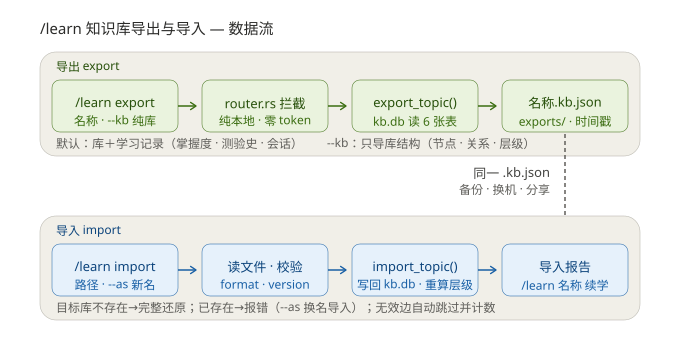

# /learn 知识库导出与导入

> v0.7.3 新增。把知识库（及学习记录）导出为单个 `.kb.json` 文件，跨机器备份、换机迁移、分享给他人从零学习。



## 命令

| 命令 | 作用 |
|------|------|
| `/learn export <名称>` | 完整导出：库结构 + 学习记录（掌握度/测验史/学习会话） |
| `/learn export <名称> --kb` | 纯库导出：只含节点/关系/层级，适合分享他人从零学 |
| `/learn import <路径>` | 导入；自动还原文件中携带的学习记录 |
| `/learn import <路径> --as <新名>` | 换名导入（目标库重名时用） |
| 中文别名 | `导出` / `导入` |

导出文件落盘 `home/knowledge/exports/<名称>-<时间戳>.kb.json`，回复中给出绝对路径。导入支持 `~` 展开。

两条命令均为**纯本地数据操作，不经过 LLM**——router 拦截层直接处理（与 `/learn list` 同模式），零 token、瞬间完成。

## 导出文件格式（v1）

```json
{
  "format": "rhermes-kb",
  "version": 1,
  "exported_at": "2026-09-03 16:00:00",
  "topic":  { "name": "数据结构", "source": "file:指导书.pdf" },
  "graph": {
    "nodes": [{ "name": "二叉树", "summary": "...", "layer": 2 }],
    "edges": [{ "from": "树", "to": "二叉树", "relation": "包含" }]
  },
  "learning": {
    "nodes":    [{ "name": "二叉树", "mastery": 65, "review_count": 3, "quiz_count": 3, "last_review": "..." }],
    "quiz_log": [{ "node": "二叉树", "question": "...", "answer": "...", "score": 80, "created_at": "..." }],
    "sessions": [{ "node": "二叉树", "created_at": "..." }]
  }
}
```

**关键设计**：表间关联一律用 **node name**（库内 `UNIQUE(topic_id, name)` 保证唯一），不导出自增 ID——导入时重新生成，天然避免 ID 冲突。`--kb` 模式省略整个 `learning` 字段。测验历史全量导出，以维持 24h 防刷分逻辑行为一致。

## 导入策略

| 场景 | 行为 |
|------|------|
| 目标库不存在 | 完整还原（含学习记录，若文件携带） |
| 目标库已存在 | 报错，提示 `--as` 换名导入 |
| 边引用无效节点 | 复用 `add_edges` 自动跳过并计数 |
| `format`/`version` 不匹配 / JSON 解析失败 | 明确报错 |
| 导入完成 | 重算拓扑层级（`recompute_layers`），回复导入报告 |

写入使用 SQLite 事务（`unchecked_transaction`），任一步失败整体回滚，不会留下半成品库。

## 实现位置

| 文件 | 内容 |
|------|------|
| `src/knowledge/store.rs` | `KbExport` 系列 serde 结构体、`export_topic()`、`import_topic()`、`ImportReport`、roundtrip 测试 |
| `src/knowledge/mod.rs` | `exports_dir()`、`EXPORT_FORMAT`/`EXPORT_VERSION` 常量 |
| `src/agent/router.rs` | `handle_kb_export_command()` / `handle_kb_import_command()`、dispatch 拦截分支 |

## 典型场景

1. **换机/备份**：`export` 完整版 → 新机器 `import` → 学习进度无损续接
2. **教师分发**：教师建好库 → `--kb` 纯库导出 → 学生导入从零学（进度互不干扰）
3. **进度存档**：学期末导出完整版留档（时间戳文件名，可多次导出对比进度）

## 边界与已知限制

- `sources/` 原始学习资料（大文件分段落盘）不打包进 JSON——教学只依赖节点 summary，不影响续学；完整打包（zip）列为后续扩展
- `question_bank` 目前 MVP 为空，暂不导出
- 导入不做合并（merge）语义——同节点掌握度合并规则复杂，MVP 用 `--as` 换名规避
