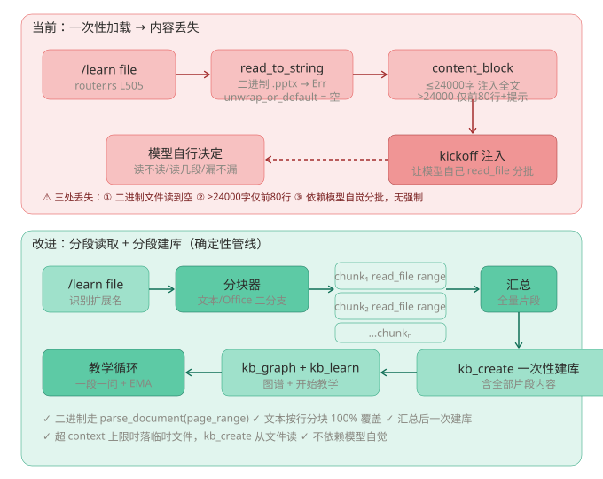

# /learn 大文件学习：分段读取与分段建库

> 版本：v0.7.2 · 模块：`src/agent/router.rs` / `src/tools/builtin.rs` / `src/tools/liteparse.rs`

## 背景问题

`/learn <文件>` 在读取大文件时会**丢失部分内容**。通读源码确认有三处丢失点，全部集中在 `router.rs` 的文件加载逻辑：

| # | 丢失点 | 触发条件 | 后果 |
|---|--------|----------|------|
| ① | 二进制文件读出来是空的 | `.pptx/.pdf/.docx/.xlsx` | `read_to_string` 对二进制返回 Err，`unwrap_or_default()` 吞错 → `content=""`，模型凭文件名瞎编 |
| ② | 超 24000 字只注入前 80 行 | 大文本文件 | kickoff 只含 80 行预览，后面内容全靠模型“自觉” |
| ③ | 分批读取是口头建议，无强制 | ②发生时 | 模型可能不读、漏读、读了后面忘前面，无任何机制验证是否读完 |

## 工作流程图

## 解决方案：确定性分段管线

核心思想：把“让模型自己分批读”改成**代码强制分段、落盘中转、逐段读取、汇总建库**。

### 1. 读入分流（消除 ①②）

`router.rs::load_study_material()`：

- **二进制文档**（pdf/docx/pptx/xlsx/png/jpg/jpeg 等）→ `liteparse::parse_document_text()` 解析为 markdown 文本
- **文本文件** → `read_to_string`
- 解析失败（如 pdfium 缺失）→ 退回文本读取，再失败则明确报错

### 2. 分段落盘（消除 ③）

内容 > 24000 字符时：

1. 按行分块，每块 ≤ `CHUNK_CHARS = 20000` 字符（行边界切分，不拆半行）
2. 逐块写入 `data_root/knowledge/sources/<库名>/part_0001.md`、`part_0002.md`…
3. kickoff 消息携带**完整 part 文件清单**，逐段 `read_file(path="...")`，强制“一段都不能遗漏”
4. 全部读完后一次性 `kb_create` 建库

### 3. 新增 kb_append 工具（分段建库）

大文件/多文件场景下，Agent 可逐段阅读后分批追加节点：

- `kb_create(topic, nodes, edges)` — 首次建库（不变）
- `kb_append(topic, nodes, edges)` — **新增**，向已有库追加节点（重名自动跳过），追加完再出图

### 4. 目录模式同步增强

`/learn <目录>` 的文件列表现在按扩展名标注读取方式：

- 二进制 → `parse_document(file_path=...)`
- 文本 → `read_file(path=...) 分段读取`

### 5. read_file 白名单扩展

落盘资料位于 `data_root`（`home/knowledge/sources/`），`read_file` 的路径校验从“仅工作目录”扩展为“工作目录 **或** data_root”，与 memory.db 等应用自有数据同信任级。

## 关键代码位置

| 文件 | 改动 |
|------|------|
| `src/agent/router.rs` | `load_study_material()` 新增；文件/目录分支 kickoff 重构 |
| `src/tools/liteparse.rs` | `parse_document_text()` 公开助手（绕过 Tool 层直调） |
| `src/tools/builtin.rs` | `KbAppend` 工具 + 注册；`read_file` 白名单加 data_root |
| `src/knowledge/mod.rs` | `sources_dir()`；`kb_tools()` 加入 KbAppend |
| `src/agent/session.rs` | `select_tools` 的 kb_* 分支加入 `kb_append` |
