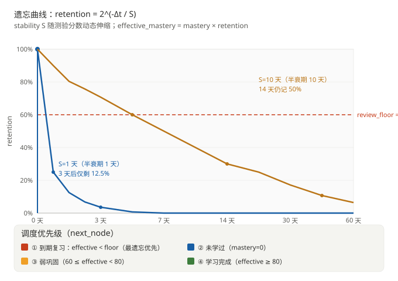

# /learn 间隔复习调度（间隔重复）— v0.7.7 / v0.7.8

> v0.7.7：艾宾浩斯指数衰减 + 可配置 review_floor
> v0.7.8：SM-2 难度系数（EF）+ Bento 待复习面板

> 模块：`src/knowledge/store.rs` / `src/tools/builtin.rs` / `src/agent/router.rs` / `src/tui/mod.rs` / `src/knowledge/svg.rs` / `src/core/config.rs`

## 背景问题

原选点逻辑 `next_node` 静态三档（初识 1 天 / 掌握中 3 天 / 精通 7 天）有两个根本缺陷：

| # | 问题 | 后果 |
|---|------|------|
| ① | **离散分档** | 同一档内（如 50→79）复习间隔相同；50 与 79 真的需要同样频率吗？ |
| ② | **档位跃迁不连续** | 从 79 升到 81 时复习间隔从 3 天突跳到 7 天，没有任何曲线平滑 |
| ③ | **掌握度本身衰减** | mastery 是历史 EMA 不衰减——一个去年 90 分的点今天可能已忘得差不多，但系统仍按 7 天间隔处理 |

## 解决方案：艾宾浩斯指数衰减

### 核心公式

```
retention(Δt, S) = 2^(-Δt/S)        ← 当前保留率（衰减曲线）
effective_mastery = mastery × retention   ← 折算后的「今天还记得多少」
```

- `S` = 记忆半衰期（天）：保留率降到 50% 所需时间
- `Δt` = 距离上次复习的天数
- `mastery` = 历史掌握度（永不衰减的 EMA 基线）
- `effective_mastery` = 当前真实掌握度（受时间衰减驱动）

### 稳定性 S 随测验分数动态伸缩

| 测验分数 | S 调整系数 | 含义 |
|----------|------------|------|
| ≥ 90 | ×2.5 | 极好，间隔大幅延长 |
| 70–89 | ×2.0 | 良好 |
| 50–69 | ×1.5 | 一般 |
| < 50 | ×0.7 | 遗忘严重，缩短间隔促重学 |

S 范围钳制：`[S_MIN=0.5, S_MAX=180]`，避免过短（每分钟复习）或过长（永不复习）。

### SM-2 难度系数 EF（v0.7.8 新增）

分档系数只看「这一次考了多少分」，无法表达**同一分数对不同难度知识点的不同含义**——一个反复考 60 分的高难点，和一个轻松考 60 分的简单点，间隔不该一样。引入 SM-2 难度系数（Easiness Factor）解决：

**质量分折算**（100 分制 → SM-2 的 0–5）：`q = round(score / 20)`

**EF 递推**：`EF' = EF + 0.1 − (5 − q)(0.08 + 0.02(5 − q))`，钳制 `[1.3, 2.8]`，初值 `EF_INIT = 2.5`

| 得分 | q | EF 变化 | 含义 |
|------|---|---------|------|
| 100 | 5 | +0.10 | 越考越轻松 |
| 80 | 4 | 0 | 难度不变 |
| 60 | 3 | −0.14 | 开始变难 |
| 40 | 2 | −0.32 | 明显吃力 |
| 20 | 1 | −0.54 | 高难点 |
| 0 | 0 | −0.80 | 极难，间隔大幅压缩 |

**调和式应用**（本项的选择）：EF 以 `EF_INIT(2.5)` 为**中性锚点**，对半衰期施加乘数：

```
ef_mult = clamp(EF / EF_INIT, 0.5, 1.2)
new_stability = clamp(current × stability_factor(score) × ef_mult, S_MIN, S_MAX)
```

- `EF = 2.5` → 乘数 `1.0` → **行为与引入 EF 前完全一致**（向后兼容锚点）
- `EF < 2.5` → 乘数 < 1 → 同一分数下间隔更短（难的东西多复习）
- `EF > 2.5` → 乘数 > 1 → 间隔更长

**注意**：稳定性更新使用**本次测验前的旧 EF**（`old.easiness`），EF 的本次变化作用于下一次测验。这保证了「首次测验时 EF 必为中性 2.5」→ 首次间隔与旧版严格一致，向后兼容锚点成立。

### 复习红线 review_floor（可配置）

`effective_mastery < review_floor` 触发复习。

- 默认 60（用户确认）
- 配置文件 `[knowledge].review_floor`
- 大于等于 review_floor 的节点视为「当前掌握良好」，进入下一档（弱巩固 / 不需复习）

### 调度优先级 `next_node`

```
① 到期复习（effective < floor）：effective ASC（最遗忘的优先）
② 未学过（mastery = 0）：layer ASC → id ASC
③ 弱巩固（60 ≤ effective < 80）：effective ASC
④ None（effective ≥ 80）：学习完成
```

### SVG 自动变浅

`src/knowledge/svg.rs::mastery_stage()` 使用 `effective_mastery` 而非历史 mastery：

- effective ≥ 80 → 实色（精通）
- effective 60–79 → 中等色（弱巩固）
- effective < 60 → 浅色（遗忘，需复习）

每次打开图谱，节点颜色自动反映「今天还记得多少」。

## 工作流程图



## 实现要点

### SQLite 迁移

通过 `PRAGMA user_version` 做幂等迁移：

```sql
-- v1（v0.7.7）
ALTER TABLE nodes ADD COLUMN stability REAL DEFAULT 1.0;
ALTER TABLE nodes ADD COLUMN next_review_at TEXT;
-- v2（v0.7.8）
ALTER TABLE nodes ADD COLUMN easiness REAL DEFAULT 2.5;
```

旧数据 backfill：`stability = clamp(2^MAX(0, review_count-1), S_MIN, S_MAX)`；`easiness` 默认 2.5（中性）。

### 导出兼容性

`EXPORT_VERSION` 演进：v1 → **v2**（新增 `stability`/`next_review_at`）→ **v3**（新增 `easiness`）。`LearnNodeOut` 每个新增字段都用 `#[serde(default)]`，保证能读旧版文件（v1/v2 导入后 `easiness` 取默认 2.5）。

### 工具层注入

`KbLearn` / `KbStatsTool` / `KbGraph` 改为带 `review_floor` 字段的 struct：
- `builtin_registry(config)` 用 `config.knowledge.review_floor` 构造
- `kb_tools()` 用 `REVIEW_FLOOR_DEFAULT` 兜底（无 config 上下文）
- `agent/router.rs` 用 `kb::store::REVIEW_FLOOR_DEFAULT`（serial gateway）
- `tui/mod.rs` 用 `self.current_config`（per-session）

### 行为变化

| 位置 | 变化 |
|------|------|
| `kb_learn` | 标题区显示 effective vs 历史 mastery（如「当前 45%（原 90%）—— 已显著遗忘，请复习」）；并显示 `难度 EF`（1.3–2.8，越低越难），Agent 据此调整讲解深度 |
| `kb_stats` | 新增「遗忘风险」段，列出 `effective < floor` 的节点及 retention% |
| `kb_graph` | 节点颜色随 effective 自动变浅；图例标注「颜色 = 当前真实掌握度」 |
| `kb_reset` | 重置时同时清空 `stability = 1.0, next_review_at = NULL, easiness = 2.5` |
| TUI `/learn` | 显示遗忘曲线提示与当前 `review_floor` 值 |
| Bento 面板 | 2×3 → **2×4** 网格：终端在框线外新增「待复习 N 个 · 最紧急 X（m%）· 平均保持率 r%」一行；HTML 面板新增「⏰ 待复习」「💧 平均保持率」两格（复用 `KbStats` 已有的 `due_reviews`/`due_review_names`/`avg_retention`） |

## 测试

- `test_due_review_scheduling`：模拟节点 X 8 天前复习 90 分（stability=2.5） → 当前 effective ≈ 90×2^(-8/2.5) ≈ 11 < 60 → 到期且优先
- `test_stability_growth_and_decay`：连续 30 / 80 / 95 分 → stability 0.7 → 1.2208 → 2.6613（分档系数 × EF 乘数 0.872，EF 由 30 分降到 2.18）
- `test_retention_decay`：纯函数测试 Δt 与 retention 单调递减关系
- `test_sm2_quality_mapping`：分数 → 质量分 q 边界（0/20/50/70/90/100）
- `test_sm2_easiness_recurrence`：EF 递推 + 双向钳制（连续满分封顶 2.8、连续零分触底 1.3）
- `test_ef_modulates_stability`：EF 中性锚点（2.5 乘数=1）、简单点间隔 > 中性 > 难点
- `test_record_quiz_updates_easiness`：首次 100 分 → EF 2.6、stability 2.5
- `test_migrate_adds_easiness`：旧库迁移后 user_version=2，新节点 EF=2.5
- `test_export_import_roundtrip`：v3 导出/导入稳定性与 EF 保留
- `test_svg_auto_fade_on_decay`：effective < 60 时节点使用浅色阶段
- `test_bento_html` / `test_terminal_bento`：2×4 网格与新「待复习 / 平均保持率」渲染
- `kb_e2e::kb_full_workflow`：端到端验证 build → learn → quiz → graph → stats 全链路

合计 **307 单元测试 + 2 集成测试**全通过。